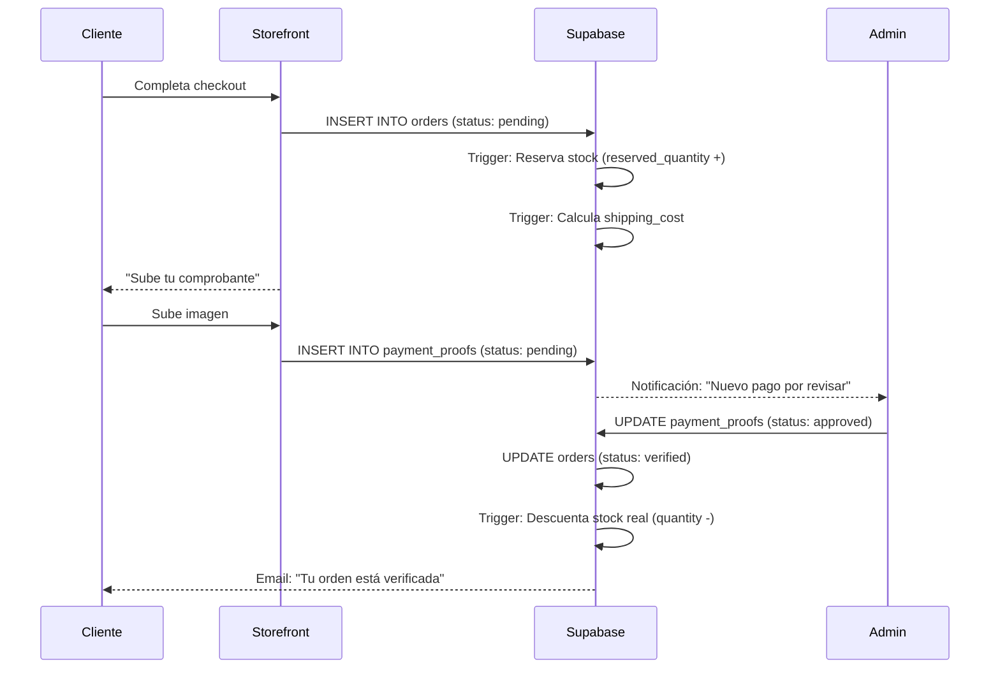

# 🏗️ ARQUITECTURA TÉCNICA - MANTUA

**Propósito**: Documentar la estructura interna, base de datos, flujos de datos y patrones de diseño  
**Audiencia**: Desarrolladores Senior y LLMs para contexto completo

---

## 📊 Base de Datos PostgreSQL

### Diseño Conceptual

La base de datos está diseñada para soportar:
1. Catálogo de productos con variantes y múltiples imágenes
2. Sistema de stock con reservas automáticas
3. Órdenes con estados y trazabilidad completa
4. Pagos manuales con upload de comprobantes
5. Sistema de envíos basado en puntos de acarreo
6. Auditoría completa de cambios

### Tablas Principales (30+ tablas)

#### 1. Catálogo

```sql
-- Productos base
CREATE TABLE products (
    id UUID PRIMARY KEY,
    name VARCHAR NOT NULL,
    slug VARCHAR UNIQUE NOT NULL,
    sku VARCHAR UNIQUE NOT NULL,
    description TEXT,
    cost_price DECIMAL(12,2),
    selling_price DECIMAL(12,2),
    puntos_acarreo INTEGER DEFAULT 0,  -- ⭐ CRÍTICO
    shipping_policy VARCHAR(20),       -- 'normal' | 'gratis'
    category_id UUID REFERENCES categories,
    published BOOLEAN DEFAULT TRUE,
    is_active BOOLEAN DEFAULT TRUE
);

-- Variantes (tallas, colores, etc.)
CREATE TABLE product_variants (
    id UUID PRIMARY KEY,
    product_id UUID REFERENCES products,
    name VARCHAR,
    sku VARCHAR UNIQUE,
    attributes JSONB,  -- {color: "rojo", talla: "M"}
    selling_price DECIMAL(12,2)
);

-- Stock por ubicación
CREATE TABLE product_stock (
    id UUID PRIMARY KEY,
    variant_id UUID REFERENCES product_variants,
    location_id UUID REFERENCES stock_locations,
    quantity INTEGER CHECK (quantity >= 0),
    reserved_quantity INTEGER CHECK (reserved_quantity >= 0),
    CONSTRAINT chk_reserved_not_exceed 
        CHECK (reserved_quantity <= quantity)
);
```

#### 2. Usuarios

```sql
-- Clientes (sincronizado con auth.users)
CREATE TABLE customers (
    id UUID PRIMARY KEY REFERENCES auth.users,  -- ⭐ PUENTE
    customer_type customer_type,  -- 'persona_natural' | 'empresa'
    first_name VARCHAR,
    last_name VARCHAR,
    document_hash TEXT UNIQUE,  -- DNI/RUC hasheado
    phone VARCHAR
);

-- Staff (administradores)
CREATE TABLE staff (
    id UUID PRIMARY KEY REFERENCES auth.users,
    role_id UUID REFERENCES staff_roles,
    first_name VARCHAR NOT NULL,
    last_name VARCHAR NOT NULL,
    is_active BOOLEAN DEFAULT TRUE
);

-- Roles con permisos JSON
CREATE TABLE staff_roles (
    id UUID PRIMARY KEY,
    name VARCHAR UNIQUE,
    permissions JSONB,  -- {"orders:verify": true}
    is_active BOOLEAN DEFAULT TRUE
);
```

#### 3. Envíos y Logística

```sql
-- Tiers de costo por puntos
CREATE TABLE tiers_acarreo (
    id UUID PRIMARY KEY,
    nombre_tier VARCHAR,
    tier_scope VARCHAR(20),  -- 'lima_callao' | 'provincia'
    tier_mode VARCHAR(20),   -- 'acarreo' | 'envio_directo'
    puntos_minimos INTEGER,
    puntos_maximos INTEGER,
    costo DECIMAL(12,2),
    CONSTRAINT chk_tier_range 
        CHECK (puntos_maximos > puntos_minimos)
);

-- Agencias de recojo
CREATE TABLE pickup_locations (
    id UUID PRIMARY KEY,
    name VARCHAR,
    departamento VARCHAR,
    provincia VARCHAR,
    distrito VARCHAR,
    direccion TEXT,
    capacidad INTEGER,
    is_active BOOLEAN DEFAULT TRUE
);

-- Direcciones de envío
CREATE TABLE shipping_addresses (
    id UUID PRIMARY KEY,
    customer_id UUID REFERENCES customers,
    label address_label,  -- 'casa' | 'trabajo' | 'agencia'
    address TEXT,
    departamento VARCHAR,  -- ⭐ Define el scope regional
    provincia VARCHAR,
    distrito VARCHAR,
    is_default BOOLEAN
);
```

#### 4. Órdenes

```sql
CREATE TABLE orders (
    id UUID PRIMARY KEY,
    customer_id UUID REFERENCES customers,
    shipping_address_id UUID REFERENCES shipping_addresses,
    pickup_location_id UUID REFERENCES pickup_locations,
    stock_location_id UUID REFERENCES stock_locations,
    
    -- Montos
    subtotal DECIMAL(12,2),
    shipping_cost DECIMAL(12,2),  -- Calculado automáticamente
    shipping_real_cost DECIMAL(12,2),  -- Ajuste manual del staff
    total_amount DECIMAL GENERATED ALWAYS AS 
        (subtotal + COALESCE(shipping_cost, 0)) STORED,
    
    -- Metadata de envío
    shipping_mode VARCHAR(20),   -- 'acarreo' | 'envio_directo' | 'pickup'
    shipping_scope VARCHAR(20),  -- 'lima_callao' | 'provincia'
    status order_status DEFAULT 'pending',
    notes TEXT,
    
    CONSTRAINT chk_shipping_mode_and_location CHECK (
        (shipping_mode IN ('acarreo', 'envio_directo') 
            AND shipping_address_id IS NOT NULL) OR
        (shipping_mode = 'pickup' 
            AND pickup_location_id IS NOT NULL)
    )
);

CREATE TABLE order_items (
    id UUID PRIMARY KEY,
    order_id UUID REFERENCES orders,
    variant_id UUID REFERENCES product_variants,
    product_name VARCHAR,  -- Desnormalizado para historial
    unit_price DECIMAL(12,2),
    unit_cost DECIMAL(12,2),  -- Para análisis de margen
    quantity INTEGER CHECK (quantity > 0),
    puntos_acarreo INTEGER  -- ⭐ Copiado del producto
);
```

#### 5. Pagos (Sistema Manual)

```sql
CREATE TABLE payment_proofs (
    id UUID PRIMARY KEY,
    order_id UUID REFERENCES orders,
    payment_method_id UUID REFERENCES payment_methods,
    proof_image_path TEXT NOT NULL,  -- URL de Supabase Storage
    operation_number VARCHAR,
    amount DECIMAL(12,2),
    status proof_status DEFAULT 'pending',  -- 'approved' | 'rejected'
    verified_by UUID REFERENCES staff,
    verified_at TIMESTAMPTZ,
    rejection_reason TEXT
);

CREATE TABLE payment_methods (
    id UUID PRIMARY KEY,
    name VARCHAR UNIQUE,  -- 'Yape', 'Plin', 'Transferencia BCP'
    is_active BOOLEAN,
    instructions TEXT  -- Número de cuenta, etc.
);
```

#### 6. Auditoría

```sql
-- Historial de cambios de estado
CREATE TABLE order_status_history (
    id UUID PRIMARY KEY,
    order_id UUID REFERENCES orders,
    old_status order_status,
    new_status order_status,
    changed_by UUID REFERENCES staff,
    notes TEXT,
    created_at TIMESTAMPTZ DEFAULT NOW()
);

-- Movimientos de inventario
CREATE TABLE inventory_logs (
    id UUID PRIMARY KEY,
    variant_id UUID REFERENCES product_variants,
    location_id UUID REFERENCES stock_locations,
    movement_type stock_movement_type,  -- 'sale' | 'return' | 'adjustment'
    quantity_change INTEGER,  -- +5 o -3
    quantity_before INTEGER,
    quantity_after INTEGER,
    reference_id UUID,  -- order_id, return_id, etc.
    created_by UUID REFERENCES staff
);
```

### Triggers y Funciones SQL Críticas

#### 1. Auto-Cálculo de Envío

```sql
CREATE OR REPLACE FUNCTION fn_recalcular_envio_single(p_order_id UUID)
RETURNS VOID AS $$
DECLARE
    v_region VARCHAR;
    v_scope VARCHAR;
    v_total_puntos INTEGER := 0;
    v_shipping_cost DECIMAL(12,2) := 0;
BEGIN
    -- 1. Obtener región del cliente
    SELECT sa.departamento INTO v_region 
    FROM orders o 
    LEFT JOIN shipping_addresses sa ON o.shipping_address_id = sa.id
    WHERE o.id = p_order_id;
    
    -- 2. Determinar scope (Lima/Callao vs Provincia)
    v_scope := CASE 
        WHEN v_region IN ('Lima','Callao') THEN 'lima_callao' 
        ELSE 'provincia' 
    END;
    
    -- 3. Sumar puntos de todos los items (respetando shipping_policy)
    SELECT COALESCE(SUM(
        CASE WHEN p.shipping_policy <> 'gratis' 
        THEN oi.puntos_acarreo * oi.quantity 
        ELSE 0 END
    ), 0)
    INTO v_total_puntos
    FROM order_items oi
    JOIN product_variants pv ON oi.variant_id = pv.id
    JOIN products p ON pv.product_id = p.id
    WHERE oi.order_id = p_order_id;
    
    -- 4. Buscar tier correspondiente
    SELECT costo INTO v_shipping_cost 
    FROM tiers_acarreo
    WHERE tier_scope = v_scope 
    AND puntos_minimos <= v_total_puntos 
    AND puntos_maximos >= v_total_puntos
    LIMIT 1;
    
    -- 5. Actualizar orden
    UPDATE orders 
    SET shipping_scope = v_scope, 
        shipping_cost = COALESCE(v_shipping_cost, 0)
    WHERE id = p_order_id;
END;
$$ LANGUAGE plpgsql;

-- Trigger que se ejecuta al INSERT/UPDATE/DELETE en order_items
CREATE TRIGGER trg_recalcular_envio_after_order_items
AFTER INSERT OR UPDATE OR DELETE ON order_items
FOR EACH STATEMENT 
EXECUTE FUNCTION fn_recalcular_envio_statement();
```

#### 2. Sincronización Auth → Customers

```sql
CREATE OR REPLACE FUNCTION handle_new_user()
RETURNS TRIGGER AS $$
BEGIN
    INSERT INTO public.customers (id, first_name, last_name)
    VALUES (
        NEW.id,
        NEW.raw_user_meta_data->>'first_name',
        NEW.raw_user_meta_data->>'last_name'
    );
    RETURN NEW;
END;
$$ LANGUAGE plpgsql SECURITY DEFINER;

CREATE TRIGGER on_auth_user_created
AFTER INSERT ON auth.users
FOR EACH ROW EXECUTE FUNCTION handle_new_user();
```

### Row Level Security (RLS)

```sql
-- Ejemplo: Customers solo ven sus propias órdenes
ALTER TABLE orders ENABLE ROW LEVEL SECURITY;

CREATE POLICY "Customers see own orders" ON orders
FOR SELECT
USING (auth.uid() = customer_id);

-- Staff con permiso "orders:view" pueden ver todas
CREATE POLICY "Staff can view all orders" ON orders
FOR SELECT
USING (
    EXISTS (
        SELECT 1 FROM staff s
        JOIN staff_roles sr ON s.role_id = sr.id
        WHERE s.id = auth.uid()
        AND (sr.permissions->>'orders:view')::boolean = true
    )
);
```

### Índices para Performance

```sql
-- Búsquedas frecuentes
CREATE INDEX idx_orders_customer_status 
ON orders(customer_id, status, created_at DESC);

CREATE INDEX idx_products_puntos_acarreo 
ON products(puntos_acarreo);

CREATE INDEX idx_payment_proofs_status 
ON payment_proofs(status);

-- Búsqueda de texto con trigram
CREATE INDEX idx_products_name_trgm 
ON products USING GIN(name gin_trgm_ops);

-- JSONB para atributos de variantes
CREATE INDEX idx_product_variants_attributes 
ON product_variants USING GIN(attributes);
```

---

## 🔄 Flujo de Datos

### 1. Cálculo de Envío (Server Action)

**Archivo**: `apps/storefront/src/actions/calculate-shipping.ts`

```typescript
export async function calculateShipping(cartItems: CartItem[], region: string) {
  const supabase = await createClient();
  let totalShipping = 0;
  
  // Determinar scope regional
  const scope = ['Lima', 'Callao'].includes(region) 
    ? 'lima_callao' 
    : 'provincia';
  
  for (const item of cartItems) {
    // 1. Obtener producto y sus puntos
    const { data: product } = await supabase
      .from('products')
      .select('puntos_acarreo, shipping_policy')
      .eq('id', item.productId)
      .single();
    
    if (product.shipping_policy === 'gratis') continue;
    
    // 2. Buscar tier correspondiente
    const { data: tier } = await supabase
      .from('tiers_acarreo')
      .select('costo')
      .eq('tier_scope', scope)
      .lte('puntos_minimos', product.puntos_acarreo)
      .gte('puntos_maximos', product.puntos_acarreo)
      .single();
    
    // 3. Sumar (multiplicado por cantidad)
    totalShipping += (tier?.costo || 0) * item.quantity;
  }
  
  return totalShipping;
}
```

### 2. Ciclo de Vida de una Orden



### 3. Arquitectura de Aplicación (Turborepo)

```
┌─────────────────────────────────────┐
│  packages/shared (El Corazón)       │
│  - database.types.ts (Generado)    │
│  - constants/order-status.ts        │
│  - utils/formatCurrency()          │
└─────────────┬───────────────────────┘
              │
       ┌──────┴──────┐
       │             │
┌──────▼─────┐  ┌───▼────────────┐
│ apps/admin │  │ apps/storefront│
│            │  │                │
│ ⚙️ Gestión  │  │ 🛍️ Público      │
│ - CRUD     │  │ - Catálogo     │
│ - Validate │  │ - Checkout     │
│ - Reports  │  │ - Carrito      │
└────────────┘  └────────────────┘
```

---

## 🎯 Patrones de Código

### Server Actions (Mutaciones)

```typescript
// apps/admin/src/actions/products.ts
'use server'

import { createClient } from '@/lib/supabase/server';
import { productSchema } from '@/lib/validations/product';
import { revalidatePath } from 'next/cache';
import { redirect } from 'next/navigation';

export async function createProduct(data: ProductFormValues) {
  const supabase = await createClient();
  
  // Validación con Zod
  const validated = productSchema.parse(data);
  
  // Insert a BD
  const { error } = await supabase
    .from('products')
    .insert([{
      ...validated,
      slug: generateSlug(validated.name)
    } as never]);
  
  if (error) return { error: error.message };
  
  // Revalidar caché de Next.js
  revalidatePath('/products');
  redirect('/products');
}
```

### Server Components (Lectura)

```typescript
// apps/admin/src/app/(dashboard)/products/page.tsx
import { createClient } from '@/lib/supabase/server';
import { ProductsClient } from '@/components/products/client';

export default async function ProductsPage() {
  const supabase = await createClient();
  
  // Consulta directa (Server-side)
  const { data: products } = await supabase
    .from('products')
    .select('*')
    .order('created_at', { ascending: false });
  
  // Pasar datos a Client Component
  return <ProductsClient products={products || []} />;
}
```

### Validación con Zod

```typescript
// apps/admin/src/lib/validations/product.ts
import { z } from 'zod';

export const productSchema = z.object({
  name: z.string().min(1, 'El nombre es obligatorio'),
  sku: z.string().min(1, 'El SKU es obligatorio'),
  selling_price: z.coerce.number().min(0),
  puntos_acarreo: z.coerce.number()
    .int()
    .min(0, 'Mínimo 0 puntos')
    .max(100, 'Máximo 100 puntos'),
  is_active: z.boolean().default(true),
  published: z.boolean().default(true)
});

export type ProductFormValues = z.infer<typeof productSchema>;
```

### Client State (Zustand para Carrito)

```typescript
// apps/storefront/src/lib/store/cart.ts
import { create } from 'zustand';
import { persist } from 'zustand/middleware';

interface CartStore {
  items: CartItem[];
  addItem: (item: CartItem) => void;
  removeItem: (id: string) => void;
  clearCart: () => void;
}

export const useCart = create<CartStore>()(
  persist(
    (set) => ({
      items: [],
      addItem: (item) => set((state) => ({
        items: [...state.items, item]
      })),
      removeItem: (id) => set((state) => ({
        items: state.items.filter((i) => i.id !== id)
      })),
      clearCart: () => set({ items: [] })
    }),
    { name: 'mantua-cart' }
  )
);
```

---

## 🔐 Seguridad

### Middleware de Autenticación

```typescript
// apps/admin/src/middleware.ts
import { createServerClient } from '@supabase/ssr';
import { NextResponse } from 'next/server';

export async function middleware(request: NextRequest) {
  const supabase = createServerClient(/* ... */);
  
  // Verificar sesión
  const { data: { user } } = await supabase.auth.getUser();
  
  if (!user) {
    return NextResponse.redirect(new URL('/login', request.url));
  }
  
  // Verificar que sea staff
  const { data: staff } = await supabase
    .from('staff')
    .select('id')
    .eq('id', user.id)
    .single();
  
  if (!staff) {
    return NextResponse.redirect(new URL('/unauthorized', request.url));
  }
  
  return NextResponse.next();
}

export const config = {
  matcher: ['/(dashboard)/:path*']
};
```

### Validación de Permisos

```typescript
// Función helper en la BD
export async function checkPermission(
  userId: string, 
  permission: string
): Promise<boolean> {
  const { data } = await supabase.rpc('has_staff_permission', {
    permission_name: permission
  });
  
  return data || false;
}

// Uso en Server Action
if (!await checkPermission(user.id, 'orders:verify')) {
  throw new Error('No tienes permisos para esta acción');
}
```

---

## 📦 Convenciones de Importación

```typescript
// Tipos de Supabase (generados)
import type { Database } from '@mantua/shared/types/database.types';

// Utilidades compartidas
import { formatCurrency } from '@mantua/shared/utils/format';

// Constantes compartidas
import { ORDER_STATUS } from '@mantua/shared/constants';

// Componentes UI (Shadcn)
import { Button } from '@/components/ui/button';
import { Badge } from '@/components/ui/badge';

// Validaciones locales
import { productSchema } from '@/lib/validations/product';

// Supabase client
import { createClient } from '@/lib/supabase/server';
```

---

## 🤖 Prompts para IA

Al trabajar con LLMs en este proyecto, proporcionar siempre:

```
"Contexto del Proyecto:
- Monorepo Next.js 15 + Supabase
- Sistema de envíos basado en 'Puntos de Acarreo' (0-100 por producto)
- Cálculo regional: lima_callao vs provincia
- Pasarela manual con upload de comprobantes
- Reserva automática de stock durante validación

Reglas de Código:
- Server Actions para mutaciones (INSERT/UPDATE/DELETE)
- Server Components para lectura (SELECT)
- Validación con Zod en todas las entradas
- Importar tipos desde @mantua/shared
- RLS activado en todas las tablas públicas

Stack:
- Next.js 15 App Router
- Supabase (PostgreSQL + Auth + Storage)
- Tailwind CSS v4
- Shadcn/UI + Lucide React
- TanStack Table para listados
- React Hook Form + Zod para formularios"
```

---

**Última actualización:** Noviembre 2025  
**Próxima revisión:** Al completar módulo de Órdenes
